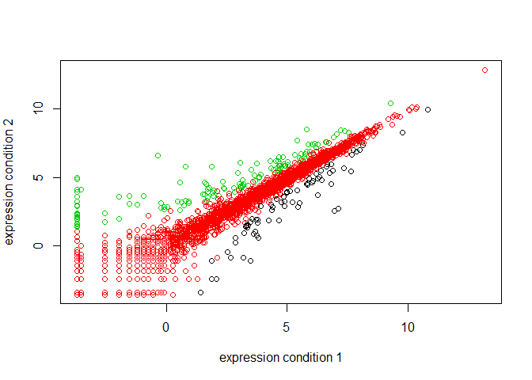

class07
================
Alyssa Shan
Thu Nov 01 11:51:37 2018

``` r
#2A: line plot
# data input of weight of baby
weight <- read.table("bimm143_05_rstats/bimm143_05_rstats/weight_chart.txt", header = TRUE)
# data plot of weight of baby
plot(weight, typ="o", pch=15, cex=1.0, lwd=2, ylim=c(2,10), xlab="Age (months)", ylab="weight (kg)", main= "Growth of baby")
```


``` r
#2B: bar plot
#data input of feature counts
feature <- read.table("bimm143_05_rstats/bimm143_05_rstats/feature_counts.txt", sep="\t", header=TRUE)
#plot features
par(mar=c(3.1,11.0,4,2))  
barplot(feature$Count, horiz = T, ylab = "", names.arg = feature$Feature, main = "Freq of genetic features", las=1, xlim = c(0,80000))
```


``` r
#2C: histograms
hist( c(rnorm(10000), rnorm(10000)+4), breaks = 50)
```


``` r
#3A: color vectors
MF_count <- read.table("bimm143_05_rstats/bimm143_05_rstats/male_female_counts.txt", header=T, sep = "\t")
barplot(MF_count$Count, ylab = "Counts", names.arg = MF_count$Sample, las= 2, col = rainbow(nrow(MF_count)))
```


``` r
#3B: color values
genes <- read.delim("bimm143_05_rstats/bimm143_05_rstats/up_down_expression.txt")
par(mar=c(5,4,4,2))
plot(genes$Condition1, genes$Condition2, col= genes$State, xlab = "expression condition 1", ylab = "expression condition 2")
```



``` r
#3C: color dynamics
meth <- read.delim("bimm143_05_rstats/bimm143_05_rstats/expression_methylation.txt")
mycols <- densCols(meth$gene.meth, meth$expression)
plot(meth$gene.meth, meth$expression, col=mycols)
```


``` r
#narrow data
sig <- meth$expression > 0
mycols2 <- densCols(meth$gene.meth[sig], meth$expression[sig])
plot(meth$gene.meth[sig], meth$expression[sig], col=mycols2)
```


``` r
rescale <- function(x, na.rm=TRUE, plot=FALSE) {
  if(na.rm) {
    rng <-range(x, na.rm=TRUE)
  } else {
    rng <-range(x)
  }
  print("Hello")
  answer <- (x - rng[1]) / (rng[2] - rng[1])
  return(answer)
  print("is it me you are looking for?")
  if(plot) {
    plot(answer, typ="b", lwd=4)
  }
  print("I can see it in ...")
}

rescale(1:10)
```

    ## [1] "Hello"

    ##  [1] 0.0000000 0.1111111 0.2222222 0.3333333 0.4444444 0.5555556 0.6666667
    ##  [8] 0.7777778 0.8888889 1.0000000
