Class 08
================
Alyssa Shan
10/15/2018

K-means clustering
------------------

example \#1 : **kmeans()** function

``` r
#example plot to see how Rmarkdown works
plot(1:10, typ= "l")
```

 back to kmeans... ctrl+alt+I

``` r
# Generate some example data for clustering
tmp <- c(rnorm(30,-3), rnorm(30,3))
x <- cbind(x=tmp, y=rev(tmp))

plot(x)
```

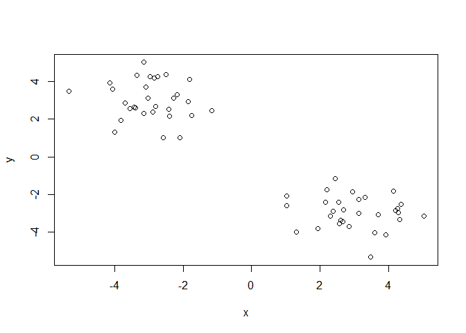

Use the kmeans() function setting k to 2 and nstart=20

``` r
k <-  kmeans(x, centers = 2, nstart = 20)
k
```

    ## K-means clustering with 2 clusters of sizes 30, 30
    ## 
    ## Cluster means:
    ##           x         y
    ## 1  3.009967 -2.943595
    ## 2 -2.943595  3.009967
    ## 
    ## Clustering vector:
    ##  [1] 2 2 2 2 2 2 2 2 2 2 2 2 2 2 2 2 2 2 2 2 2 2 2 2 2 2 2 2 2 2 1 1 1 1 1
    ## [36] 1 1 1 1 1 1 1 1 1 1 1 1 1 1 1 1 1 1 1 1 1 1 1 1 1
    ## 
    ## Within cluster sum of squares by cluster:
    ## [1] 52.44362 52.44362
    ##  (between_SS / total_SS =  91.0 %)
    ## 
    ## Available components:
    ## 
    ## [1] "cluster"      "centers"      "totss"        "withinss"    
    ## [5] "tot.withinss" "betweenss"    "size"         "iter"        
    ## [9] "ifault"

How many points are in each cluster?

``` r
k$size
```

    ## [1] 30 30

What ‘component’ of your result object details - cluster size? `k$size` - cluster assignment/membership? `30, 30` - cluster center? `k$centers`

``` r
k$cluster
```

    ##  [1] 2 2 2 2 2 2 2 2 2 2 2 2 2 2 2 2 2 2 2 2 2 2 2 2 2 2 2 2 2 2 1 1 1 1 1
    ## [36] 1 1 1 1 1 1 1 1 1 1 1 1 1 1 1 1 1 1 1 1 1 1 1 1 1

``` r
table(k$cluster)
```

    ## 
    ##  1  2 
    ## 30 30

``` r
k$centers
```

    ##           x         y
    ## 1  3.009967 -2.943595
    ## 2 -2.943595  3.009967

Plot x colored by the kmeans cluster assignment and add cluster centers as blue points

``` r
palette(c("black", "red"))
plot (x, col=k$cluster)
points(k$centers, col="blue", pch =20, cex=2)
```

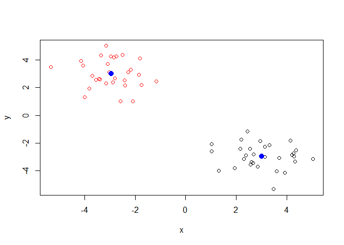

Repeat for k=3, which has the lower tot.withinss?

``` r
k3 <- kmeans(x, centers = 3, nstart = 20)

k3$tot.withinss
```

    ## [1] 82.14874

``` r
k$tot.withinss
```

    ## [1] 104.8872

k3 has lower tot.withinss

create elbow

``` r
k2 <- kmeans(x, centers = 2, nstart = 20)
k3 <- kmeans(x, centers = 3, nstart = 20)
k4 <- kmeans(x, centers = 4, nstart = 20)
k5 <- kmeans(x, centers = 5, nstart = 20)

k2$tot.withinss
```

    ## [1] 104.8872

``` r
k3$tot.withinss
```

    ## [1] 82.14874

``` r
k4$tot.withinss
```

    ## [1] 59.41023

``` r
k5$tot.withinss
```

    ## [1] 50.07459

``` r
plot(c(k2$tot.withinss, k3$tot.withinss, k4$tot.withinss, k5$tot.withinss))
```

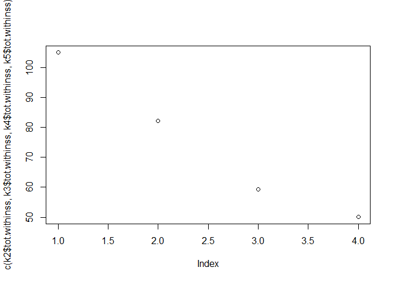

hierarchical clustering
-----------------------

trying **hclust ()** in R example \#1:

``` r
d <- dist(x)
hc <- hclust(d)
plot(hc)
```

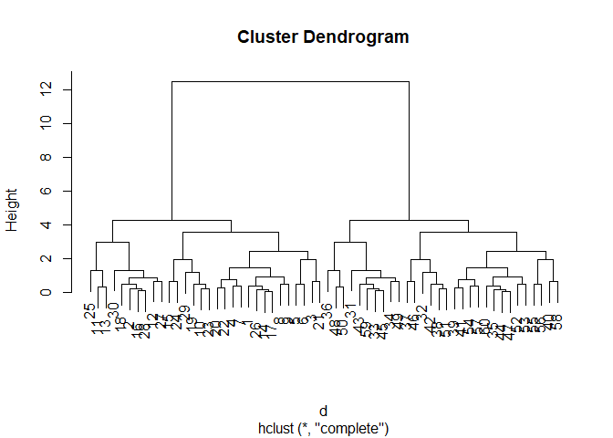

create membership clusters

``` r
plot(hc)
abline(h=8, col="red")
```

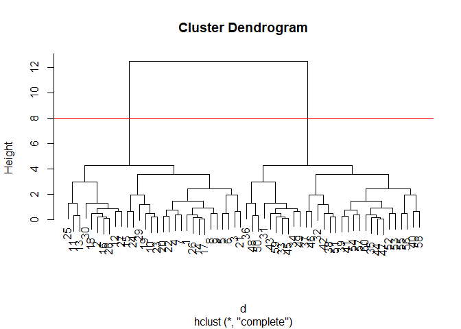

``` r
cutree(hc, h=8)
```

    ##  [1] 1 1 1 1 1 1 1 1 1 1 1 1 1 1 1 1 1 1 1 1 1 1 1 1 1 1 1 1 1 1 2 2 2 2 2
    ## [36] 2 2 2 2 2 2 2 2 2 2 2 2 2 2 2 2 2 2 2 2 2 2 2 2 2

``` r
#or cutree(hc, k=2)
```

example \#2: Step 1. Generate some example data for clustering

``` r
x <- rbind(
 matrix(rnorm(100, mean=0, sd = 0.3), ncol = 2), # c1
 matrix(rnorm(100, mean = 1, sd = 0.3), ncol = 2), # c2
 matrix(c(rnorm(50, mean = 1, sd = 0.3), # c3
 rnorm(50, mean = 0, sd = 0.3)), ncol = 2))
colnames(x) <- c("x", "y")
```

Step 2. Plot the data without clustering

``` r
plot(x)
```

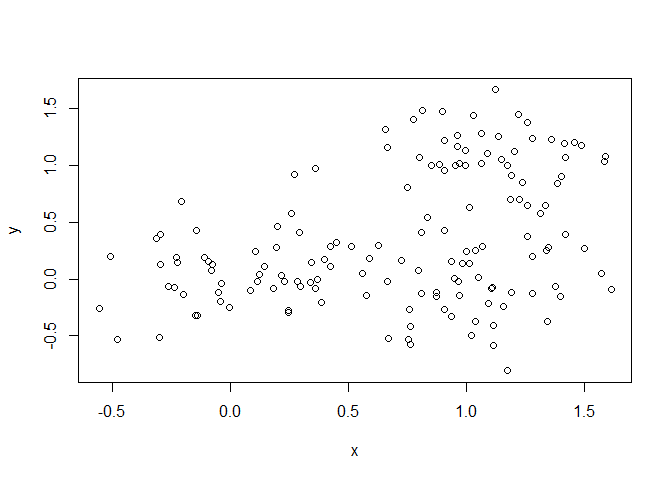 Generate colors for known clusters (just so we can compare to hclust results)

``` r
col <- as.factor( rep(c("c1","c2","c3"), each=50) )

palette(c("red", "blue", "green"))
plot(x, col=col)
```

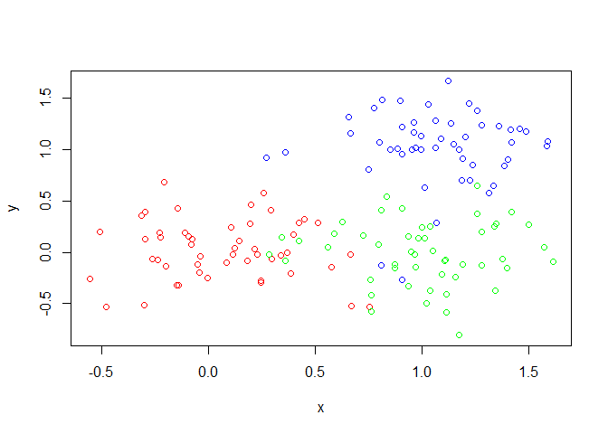

Use the dist(), hclust(), plot() and cutree() functions to return 2 and 3 clusters

``` r
d <- dist(x)
hc <- hclust(d)
plot(hc)
```

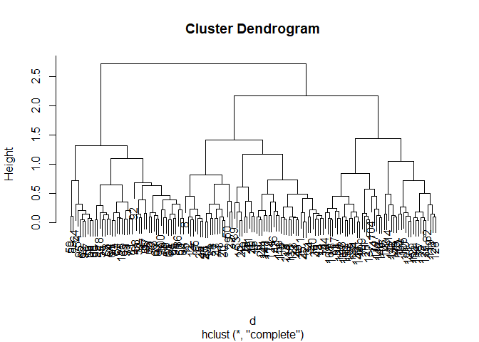

``` r
cluster2 <- cutree(hc, k=2)
table(cluster2, col)
```

    ##         col
    ## cluster2 c1 c2 c3
    ##        1 50  4 49
    ##        2  0 46  1

``` r
cluster3 <- cutree(hc, k=3)
table(cluster3, col)
```

    ##         col
    ## cluster3 c1 c2 c3
    ##        1 48  0  9
    ##        2  2  4 40
    ##        3  0 46  1

``` r
table(col, col)
```

    ##     col
    ## col  c1 c2 c3
    ##   c1 50  0  0
    ##   c2  0 50  0
    ##   c3  0  0 50

make up data

``` r
mydata <- matrix(nrow=100, ncol=10) 
rownames(mydata) <- paste("gene", 1:100, sep="") 
colnames(mydata) <- c( paste("wt", 1:5, sep=""),
 paste("ko", 1:5, sep="") ) 
for(i in 1:nrow(mydata)) {
 wt.values <- rpois(5, lambda=sample(x=10:1000, size=1))
 ko.values <- rpois(5, lambda=sample(x=10:1000, size=1))

 mydata[i,] <- c(wt.values, ko.values)
}
head(mydata)
```

    ##       wt1 wt2 wt3 wt4 wt5 ko1 ko2 ko3 ko4 ko5
    ## gene1  64  47  67  53  59 633 647 664 615 588
    ## gene2 212 195 185 193 203 438 445 398 440 449
    ## gene3  35  34  29  26  28 708 695 715 680 719
    ## gene4 329 347 365 335 347 658 695 689 672 656
    ## gene5 272 341 295 324 299 194 172 217 213 201
    ## gene6 847 831 868 850 858 723 700 715 646 725

do PCA

``` r
pca <- prcomp(t(mydata), scale=TRUE) 
#t() is to transpose data: flip columns to row, etc
```

plot pca in 2d plot

``` r
# x = pc1 and pc2
plot(pca$x[,1], pca$x[,2])
```

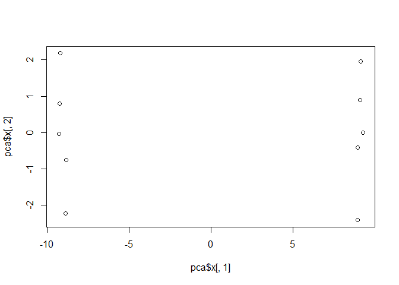

variance in pca

``` r
pca.var <- pca$sdev^2

#percent variance
pca.var.per <- round(pca.var/sum(pca.var)*100, 1) 
pca.var.per
```

    ##  [1] 91.4  2.4  1.6  1.5  1.0  0.7  0.6  0.4  0.3  0.0

barplot

``` r
barplot(pca.var.per, main="Scree Plot",
 xlab="Principal Component", ylab="Percent Variation")
```

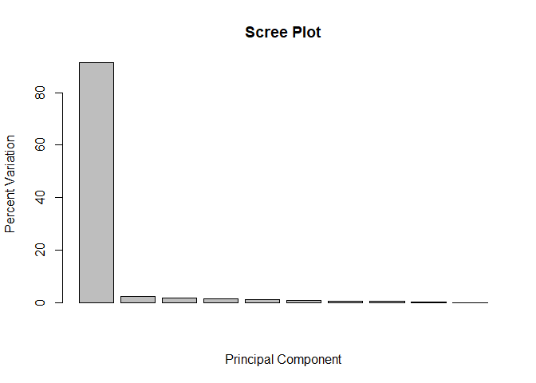 according to scree plot, big difference btw the two groups along PC1 axis

make PC plot more useful/better to read

``` r
#create color vector
colvec <- colnames(mydata)
colvec[grep("wt", colvec)] <- "red"
colvec[grep("ko", colvec)] <- "blue"

#prettied plot
plot(pca$x[,1], pca$x[,2], col=colvec, pch=16,
 xlab=paste0("PC1 (", pca.var.per[1], "%)"),
 ylab=paste0("PC2 (", pca.var.per[2], "%)")) 
```

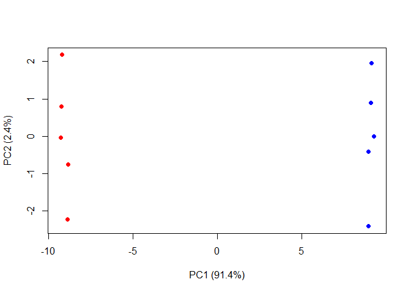

PCA of UK food data
-------------------

read data

``` r
x <- read.csv("UK_foods.csv")
dim(x)
```

    ## [1] 17  5

``` r
head(x)
```

    ##                X England Wales Scotland N.Ireland
    ## 1         Cheese     105   103      103        66
    ## 2  Carcass_meat      245   227      242       267
    ## 3    Other_meat      685   803      750       586
    ## 4           Fish     147   160      122        93
    ## 5 Fats_and_oils      193   235      184       209
    ## 6         Sugars     156   175      147       139

reset row name so x is not a column

``` r
rownames(x) <- x[,1]
x <- x[,-1]
head(x)
```

    ##                England Wales Scotland N.Ireland
    ## Cheese             105   103      103        66
    ## Carcass_meat       245   227      242       267
    ## Other_meat         685   803      750       586
    ## Fish               147   160      122        93
    ## Fats_and_oils      193   235      184       209
    ## Sugars             156   175      147       139

``` r
dim(x)
```

    ## [1] 17  4
