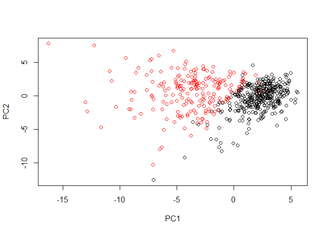
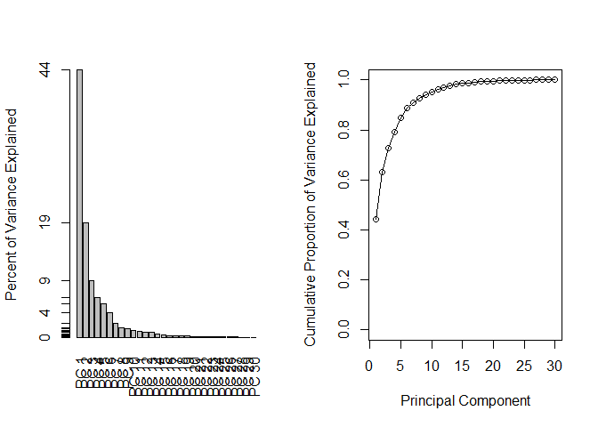
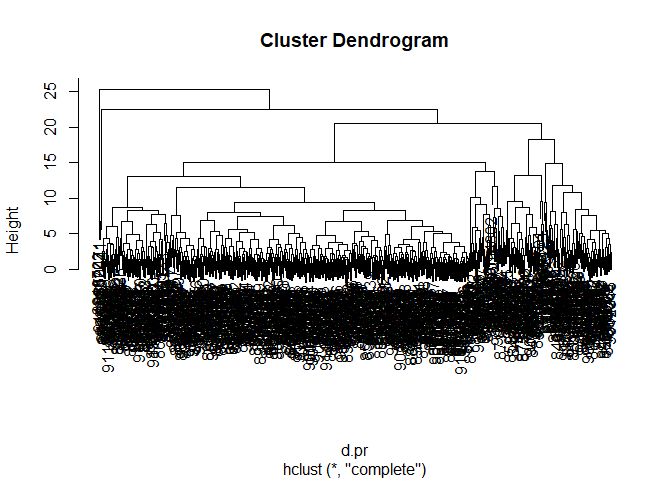
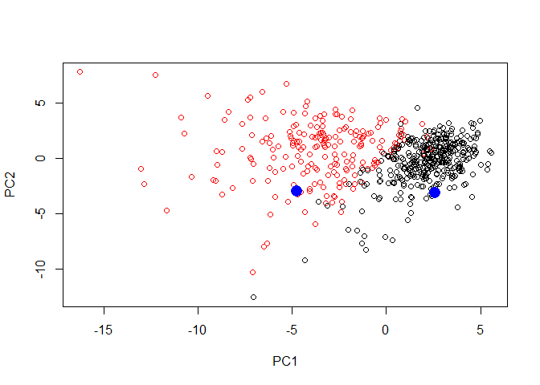

class09
================
Alyssa Shan
October 30, 2018

Section 1
=========

Preparing data
--------------

``` r
url <- "https://bioboot.github.io/bimm143_W18/class-material/WisconsinCancer.csv"
wisc.df <- read.csv(url)
```

Editing input data
------------------

``` r
#exlude data to columns 3-32
wisc.data <- as.matrix(wisc.df [,3:32])

#set the row names of wisc.data
row.names(wisc.data) <- wisc.df$id
```

Create Diagnosis vector
-----------------------

``` r
diagnosis <-  as.numeric(wisc.df$diagnosis == "M")
diagnosis
```

    ##   [1] 1 1 1 1 1 1 1 1 1 1 1 1 1 1 1 1 1 1 1 0 0 0 1 1 1 1 1 1 1 1 1 1 1 1 1
    ##  [36] 1 1 0 1 1 1 1 1 1 1 1 0 1 0 0 0 0 0 1 1 0 1 1 0 0 0 0 1 0 1 1 0 0 0 0
    ##  [71] 1 0 1 1 0 1 0 1 1 0 0 0 1 1 0 1 1 1 0 0 0 1 0 0 1 1 0 0 0 1 1 0 0 0 0
    ## [106] 1 0 0 1 0 0 0 0 0 0 0 0 1 1 1 0 1 1 0 0 0 1 1 0 1 0 1 1 0 1 1 0 0 1 0
    ## [141] 0 1 0 0 0 0 1 0 0 0 0 0 0 0 0 0 1 0 0 0 0 1 1 0 1 0 0 1 1 0 0 1 1 0 0
    ## [176] 0 0 1 0 0 1 1 1 0 1 0 1 0 0 0 1 0 0 1 1 0 1 1 1 1 0 1 1 1 0 1 0 1 0 0
    ## [211] 1 0 1 1 1 1 0 0 1 1 0 0 0 1 0 0 0 0 0 1 1 0 0 1 0 0 1 1 0 1 0 0 0 0 1
    ## [246] 0 0 0 0 0 1 0 1 1 1 1 1 1 1 1 1 1 1 1 1 1 0 0 0 0 0 0 1 0 1 0 0 1 0 0
    ## [281] 1 0 1 1 0 0 0 0 0 0 0 0 0 0 0 0 0 1 0 0 1 0 1 0 0 0 0 0 0 0 0 0 0 0 0
    ## [316] 0 0 1 0 0 0 1 0 1 0 0 0 0 1 1 1 0 0 0 0 1 0 1 0 1 0 0 0 1 0 0 0 0 0 0
    ## [351] 0 1 1 1 0 0 0 0 0 0 0 0 0 0 0 1 1 0 1 1 1 0 1 1 0 0 0 0 0 1 0 0 0 0 0
    ## [386] 1 0 0 0 1 0 0 1 1 0 0 0 0 0 0 1 0 0 0 0 0 0 0 1 0 0 0 0 0 1 0 0 1 0 0
    ## [421] 0 0 0 0 0 0 0 0 0 0 1 0 1 1 0 1 0 0 0 0 0 1 0 0 1 0 1 0 0 1 0 1 0 0 0
    ## [456] 0 0 0 0 0 1 1 0 0 0 0 0 0 1 0 0 0 0 0 0 0 0 0 0 1 0 0 0 0 0 0 0 1 0 1
    ## [491] 0 0 1 0 0 0 0 0 1 1 0 1 0 1 0 0 0 0 0 1 0 0 1 0 1 0 1 1 0 0 0 1 0 0 0
    ## [526] 0 0 0 0 0 0 0 0 1 0 1 1 0 0 0 0 0 0 0 0 0 0 0 0 0 0 0 0 0 0 0 0 0 0 0
    ## [561] 0 0 1 1 1 1 1 1 0

``` r
table(diagnosis)
```

    ## diagnosis
    ##   0   1 
    ## 357 212

Exploratory Data Analysis
-------------------------

``` r
#Q1. How many observations are in this dataset?
dim(wisc.data)
```

    ## [1] 569  30

There are 30 observations in dataset

``` r
##Q2. How many variables/features in the data are suffixed with _mean?
x <- grep("_mean", colnames(wisc.data))
length(x)
```

    ## [1] 10

There are 10 features suffized with "\_mean" in dataset

``` r
##Q3. How many of the observations have a malignant diagnosis?
#Need to reference wisc.df since wisc.data has diagnosis column removed
y <- as.numeric(wisc.df$diagnosis == "M")
sum(y)
```

    ## [1] 212

There are 212 malignant diagnosis

Section 2
=========

Performing PCA
--------------

``` r
#Check column means and stdev
colMeans(wisc.data)
```

    ##             radius_mean            texture_mean          perimeter_mean 
    ##            1.412729e+01            1.928965e+01            9.196903e+01 
    ##               area_mean         smoothness_mean        compactness_mean 
    ##            6.548891e+02            9.636028e-02            1.043410e-01 
    ##          concavity_mean     concave.points_mean           symmetry_mean 
    ##            8.879932e-02            4.891915e-02            1.811619e-01 
    ##  fractal_dimension_mean               radius_se              texture_se 
    ##            6.279761e-02            4.051721e-01            1.216853e+00 
    ##            perimeter_se                 area_se           smoothness_se 
    ##            2.866059e+00            4.033708e+01            7.040979e-03 
    ##          compactness_se            concavity_se       concave.points_se 
    ##            2.547814e-02            3.189372e-02            1.179614e-02 
    ##             symmetry_se    fractal_dimension_se            radius_worst 
    ##            2.054230e-02            3.794904e-03            1.626919e+01 
    ##           texture_worst         perimeter_worst              area_worst 
    ##            2.567722e+01            1.072612e+02            8.805831e+02 
    ##        smoothness_worst       compactness_worst         concavity_worst 
    ##            1.323686e-01            2.542650e-01            2.721885e-01 
    ##    concave.points_worst          symmetry_worst fractal_dimension_worst 
    ##            1.146062e-01            2.900756e-01            8.394582e-02

``` r
apply(wisc.data, 2, sd)
```

    ##             radius_mean            texture_mean          perimeter_mean 
    ##            3.524049e+00            4.301036e+00            2.429898e+01 
    ##               area_mean         smoothness_mean        compactness_mean 
    ##            3.519141e+02            1.406413e-02            5.281276e-02 
    ##          concavity_mean     concave.points_mean           symmetry_mean 
    ##            7.971981e-02            3.880284e-02            2.741428e-02 
    ##  fractal_dimension_mean               radius_se              texture_se 
    ##            7.060363e-03            2.773127e-01            5.516484e-01 
    ##            perimeter_se                 area_se           smoothness_se 
    ##            2.021855e+00            4.549101e+01            3.002518e-03 
    ##          compactness_se            concavity_se       concave.points_se 
    ##            1.790818e-02            3.018606e-02            6.170285e-03 
    ##             symmetry_se    fractal_dimension_se            radius_worst 
    ##            8.266372e-03            2.646071e-03            4.833242e+00 
    ##           texture_worst         perimeter_worst              area_worst 
    ##            6.146258e+00            3.360254e+01            5.693570e+02 
    ##        smoothness_worst       compactness_worst         concavity_worst 
    ##            2.283243e-02            1.573365e-01            2.086243e-01 
    ##    concave.points_worst          symmetry_worst fractal_dimension_worst 
    ##            6.573234e-02            6.186747e-02            1.806127e-02

``` r
#Perform PCA on wisc.data 
wisc.pr <- prcomp(wisc.data, scale=T)

#summarize PCA
summary(wisc.pr)
```

    ## Importance of components:
    ##                           PC1    PC2     PC3     PC4     PC5     PC6
    ## Standard deviation     3.6444 2.3857 1.67867 1.40735 1.28403 1.09880
    ## Proportion of Variance 0.4427 0.1897 0.09393 0.06602 0.05496 0.04025
    ## Cumulative Proportion  0.4427 0.6324 0.72636 0.79239 0.84734 0.88759
    ##                            PC7     PC8    PC9    PC10   PC11    PC12
    ## Standard deviation     0.82172 0.69037 0.6457 0.59219 0.5421 0.51104
    ## Proportion of Variance 0.02251 0.01589 0.0139 0.01169 0.0098 0.00871
    ## Cumulative Proportion  0.91010 0.92598 0.9399 0.95157 0.9614 0.97007
    ##                           PC13    PC14    PC15    PC16    PC17    PC18
    ## Standard deviation     0.49128 0.39624 0.30681 0.28260 0.24372 0.22939
    ## Proportion of Variance 0.00805 0.00523 0.00314 0.00266 0.00198 0.00175
    ## Cumulative Proportion  0.97812 0.98335 0.98649 0.98915 0.99113 0.99288
    ##                           PC19    PC20   PC21    PC22    PC23   PC24
    ## Standard deviation     0.22244 0.17652 0.1731 0.16565 0.15602 0.1344
    ## Proportion of Variance 0.00165 0.00104 0.0010 0.00091 0.00081 0.0006
    ## Cumulative Proportion  0.99453 0.99557 0.9966 0.99749 0.99830 0.9989
    ##                           PC25    PC26    PC27    PC28    PC29    PC30
    ## Standard deviation     0.12442 0.09043 0.08307 0.03987 0.02736 0.01153
    ## Proportion of Variance 0.00052 0.00027 0.00023 0.00005 0.00002 0.00000
    ## Cumulative Proportion  0.99942 0.99969 0.99992 0.99997 1.00000 1.00000

Q4. From your results, what proportion of the original variance is captured by the first principal components (PC1)?

Q5. How many principal components (PCs) are required to describe at least 70% of the original variance in the data?

Q6. How many principal components (PCs) are required to describe at least 90% of the original variance in the data?

Interpreting PCA results
------------------------

``` r
#creat biplot of wisc.pr
biplot(wisc.pr)
```


``` r
attributes(wisc.pr)
```

    ## $names
    ## [1] "sdev"     "rotation" "center"   "scale"    "x"       
    ## 
    ## $class
    ## [1] "prcomp"

``` r
#scatter plot PC1 vs PC2
plot(wisc.pr$x[,1], wisc.pr$x[,2],  col= diagnosis+1, xlab = "PC1", ylab = "PC2")
```



``` r
#scatter plot PC1 vs PC3
plot(wisc.pr$x[,c(1,3)], col = diagnosis+1, xlab = "PC1", ylab = "PC3")
```


Variance explained
------------------

``` r
#calculate variance
pr.var <- wisc.pr$sdev^2

#principal component: pve
pve <- pr.var/sum(pr.var)
pve
```

    ##  [1] 4.427203e-01 1.897118e-01 9.393163e-02 6.602135e-02 5.495768e-02
    ##  [6] 4.024522e-02 2.250734e-02 1.588724e-02 1.389649e-02 1.168978e-02
    ## [11] 9.797190e-03 8.705379e-03 8.045250e-03 5.233657e-03 3.137832e-03
    ## [16] 2.662093e-03 1.979968e-03 1.753959e-03 1.649253e-03 1.038647e-03
    ## [21] 9.990965e-04 9.146468e-04 8.113613e-04 6.018336e-04 5.160424e-04
    ## [26] 2.725880e-04 2.300155e-04 5.297793e-05 2.496010e-05 4.434827e-06

``` r
#plot variance 
plot(pve, xlab = "Principal Component", ylab = "Proportion of Variance Explained", ylim = c(0,1), type = "o")
```


``` r
#side by side plot
par(mfrow = c(1,2))

#Barplot variance
barplot(pve, ylab = "Percent of Variance Explained", names.arg = paste("PC", 1:length(pve)), las=2, axes = F)
#turn off standard axis measurements
axis(2, at=pve, labels=round(pve,2)*100)

#cumulative proportion of variance
plot(cumsum(pve), xlab = "Principal Component", 
     ylab = "Cumulative Proportion of Variance Explained", 
     ylim = c(0, 1), type = "o")
```



Communicating PCA results
-------------------------

Q9. For the first principal component, what is the component of the loading vector (i.e. wisc.pr$rotation\[,1\]) for the feature concave.points\_mean?

Q10. What is the minimum number of principal components required to explain 80% of the variance of the data? 4 PCs

Section 3
=========

Hierarchical clustering of case data
------------------------------------

``` r
# Scale the wisc.data 
data.scaled <- scale(wisc.data)

#Calculate distances
data.dist <- dist(data.scaled)

#create hclust
wisc.hclust <- hclust(data.dist, method = "complete")
plot(wisc.hclust)
```

 Q11. Using the plot() function, what is the height at which the clustering model has 4 clusters? 20

Selecting number of clusters
----------------------------

``` r
#cut tree
wisc.hclust.clusters <- cutree(wisc.hclust, k=4)

table(wisc.hclust.clusters, diagnosis)
```

    ##                     diagnosis
    ## wisc.hclust.clusters   0   1
    ##                    1  12 165
    ##                    2   2   5
    ##                    3 343  40
    ##                    4   0   2

cluster 1 largely corresponds to malignant cells (with diagnosis values of 1) whilst cluster 3 largely corresponds to benign cells (with diagnosis values of 0).

Q12. Can you find a better cluster vs diagnoses match with by cutting into a different number of clusters between 2 and 10?

``` r
wisc.hclust.clusters <- cutree(wisc.hclust, k=2)

table(wisc.hclust.clusters, diagnosis)
```

    ##                     diagnosis
    ## wisc.hclust.clusters   0   1
    ##                    1 357 210
    ##                    2   0   2

``` r
wisc.hclust.clusters <- cutree(wisc.hclust, k=10)

table(wisc.hclust.clusters, diagnosis)
```

    ##                     diagnosis
    ## wisc.hclust.clusters   0   1
    ##                   1   12  86
    ##                   2    0  59
    ##                   3    0   3
    ##                   4  331  39
    ##                   5    0  20
    ##                   6    2   0
    ##                   7   12   0
    ##                   8    0   2
    ##                   9    0   2
    ##                   10   0   1

Section 5
=========

Clustering on PCA results
-------------------------

``` r
#create distance vector of 1st 7 PCs for clustering
d.pr <-  dist(wisc.pr$x[,1:7])

#create hclust
wisc.pr.hclust <- hclust(d.pr, method= "complete")
plot(wisc.pr.hclust)
```



``` r
#cut hierarchical clustering
wisc.pr.hclust.clusters <- cutree(wisc.pr.hclust, k=4)
table(wisc.pr.hclust.clusters, diagnosis)
```

    ##                        diagnosis
    ## wisc.pr.hclust.clusters   0   1
    ##                       1   5 113
    ##                       2 350  97
    ##                       3   2   0
    ##                       4   0   2

BONUS
=====

Predictive Modeling with PCA components
---------------------------------------

``` r
url <- "https://tinyurl.com/new-samples-CSV"
new <- read.csv(url)
npc <- predict(wisc.pr, newdata=new)

plot(wisc.pr$x[,1:2], col=diagnosis+1)
points(npc[,1], npc[,2], col="blue", pch=16, cex= 2)
```



predicting potential malignancy of new samples. In this case, 1 sample might be maligant; while other sample, benign.
