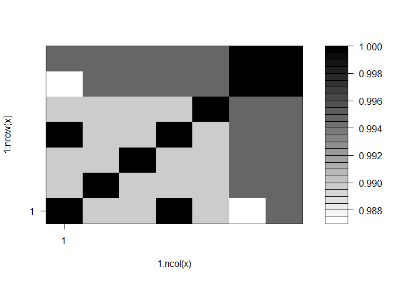
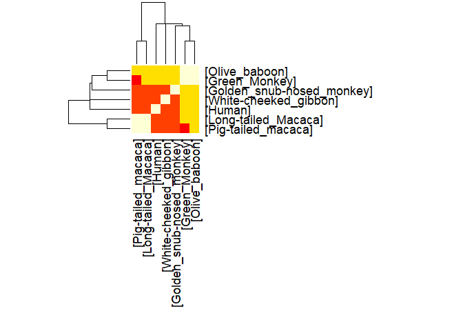

midterm: find a gene
================

Read FASTA format alignment
---------------------------

``` r
library(bio3d)
cluster <- read.fasta("cluster")
```

Calculate sequence identity matrix
----------------------------------

``` r
seq.ide <- seqidentity(cluster)

#plot identity matrix
plot.dmat(seq.ide, color.palette = mono.colors)
```



Generate heatmap plot
---------------------

``` r
heatmap(seq.ide, margins = c(18, 18), scale= "none")
```



Search for most similar atomic resolution to aligned seq
--------------------------------------------------------

``` r
consensus <- consensus(cluster)
print(consensus$`seq`)
```

    ##   [1] "-" "-" "-" "-" "-" "-" "-" "-" "-" "-" "-" "-" "-" "-" "-" "-" "-"
    ##  [18] "-" "-" "-" "-" "-" "-" "-" "-" "-" "-" "-" "-" "-" "-" "-" "-" "-"
    ##  [35] "-" "-" "-" "-" "-" "-" "-" "-" "-" "-" "-" "-" "-" "-" "-" "-" "-"
    ##  [52] "-" "-" "-" "-" "-" "-" "-" "-" "-" "-" "-" "-" "-" "M" "K" "W" "V"
    ##  [69] "W" "A" "L" "L" "L" "L" "A" "A" "L" "G" "S" "G" "R" "A" "E" "R" "D"
    ##  [86] "C" "R" "V" "S" "S" "F" "R" "V" "K" "E" "N" "F" "D" "K" "A" "R" "F"
    ## [103] "S" "G" "T" "W" "Y" "A" "M" "A" "K" "K" "D" "P" "E" "G" "L" "F" "L"
    ## [120] "Q" "D" "N" "I" "V" "A" "E" "F" "S" "V" "D" "E" "T" "G" "Q" "M" "S"
    ## [137] "A" "T" "A" "K" "G" "R" "V" "R" "L" "L" "N" "N" "W" "D" "V" "C" "A"
    ## [154] "D" "M" "V" "G" "T" "F" "T" "D" "T" "E" "D" "P" "A" "K" "F" "K" "M"
    ## [171] "K" "Y" "W" "G" "V" "A" "S" "F" "L" "Q" "K" "G" "N" "D" "D" "H" "W"
    ## [188] "I" "I" "D" "T" "D" "Y" "D" "T" "Y" "A" "V" "Q" "Y" "S" "C" "R" "L"
    ## [205] "L" "N" "L" "D" "G" "T" "C" "A" "D" "S" "Y" "S" "F" "V" "F" "S" "R"
    ## [222] "D" "P" "N" "G" "L" "P" "P" "E" "A" "Q" "K" "I" "V" "R" "Q" "R" "Q"
    ## [239] "E" "E" "L" "C" "L" "A" "R" "Q" "Y" "R" "L" "I" "V" "H" "N" "G" "Y"
    ## [256] "C" "D" "G" "R" "S" "E" "R" "N" "L" "L"

``` r
blast <- blast.pdb(consensus$seq)
```

    ##  Searching ... please wait (updates every 5 seconds) RID = 0DG9TEFX015 
    ##  .
    ##  Reporting 85 hits

``` r
print(blast)
```

    ## $hit.tbl
    ##        queryid subjectids identity alignmentlength mismatches gapopens
    ## 1  Query_51091     4O9S_A   98.387             186          3        0
    ## 2  Query_51091     3FMZ_A   98.387             186          3        0
    ## 3  Query_51091     1JYD_A   99.451             182          1        0
    ## 4  Query_51091     1BRP_A   99.451             182          1        0
    ## 5  Query_51091     1JYJ_A   98.352             182          3        0
    ## 6  Query_51091     1QAB_E   97.778             180          4        0
    ## 7  Query_51091     2WQA_E   98.870             177          2        0
    ## 8  Query_51091     3BSZ_E   99.432             176          1        0
    ## 9  Query_51091     2WQ9_A   99.425             174          1        0
    ## 10 Query_51091     2WR6_A   98.857             175          2        0
    ## 11 Query_51091     1AQB_A   93.443             183         12        0
    ## 12 Query_51091     1HBQ_A   92.896             183         13        0
    ## 13 Query_51091     1KT3_A   92.896             183         13        0
    ## 14 Query_51091     1KT5_A   93.714             175         11        0
    ## 15 Query_51091     1RLB_E   93.103             174         12        0
    ## 16 Query_51091     1IIU_A   86.628             172         23        0
    ## 17 Query_51091     5EZ2_A   26.404             178        116        7
    ## 18 Query_51091     5F6Z_A   30.137             146         89        6
    ## 19 Query_51091     2HZQ_A   27.083             144         82        7
    ## 20 Query_51091     2NND_A   23.684             152         93        6
    ## 21 Query_51091     4R0B_A   26.168             107         68        4
    ## 22 Query_51091     1IW2_A   26.829             123         80        4
    ## 23 Query_51091     2QOS_C   25.439             114         77        3
    ## 24 Query_51091     2OVD_A   25.439             114         77        3
    ## 25 Query_51091     1GKA_B   28.767              73         49        2
    ## 26 Query_51091     2OVA_A   25.410             122         83        3
    ## 27 Query_51091     6GQZ_A   20.635             126         71        5
    ## 28 Query_51091     4ES7_A   22.314             121         66        5
    ## 29 Query_51091     4IAX_A   23.387             124         70        6
    ## 30 Query_51091     3KZA_A   29.907             107         58        6
    ## 31 Query_51091     3QKG_A   23.140             121         65        5
    ## 32 Query_51091     1QWD_A   26.829              82         59        1
    ## 33 Query_51091     2ACO_A   26.829              82         59        1
    ## 34 Query_51091     3DSZ_A   22.222             126         69        6
    ## 35 Query_51091     3MBT_A   26.829              82         59        1
    ## 36 Query_51091     3OJY_C   24.561             114         78        3
    ## 37 Query_51091     1EW3_A   22.785             158         82        7
    ## 38 Query_51091     2RD7_C   24.561             114         78        3
    ## 39 Query_51091     4ORW_A   23.288             146         76        7
    ## 40 Query_51091     4ORR_A   23.288             146         76        7
    ## 41 Query_51091     1JZU_A   22.302             139         96        4
    ## 42 Query_51091     5NGH_A   22.581             155         94        6
    ## 43 Query_51091     4OS0_A   23.288             146         76        7
    ## 44 Query_51091     1H91_A   48.649              37         17        2
    ## 45 Query_51091     1GM6_A   21.512             172         94        9
    ## 46 Query_51091     2K23_A   21.368             117         77        3
    ## 47 Query_51091     4K6M_A   32.258              93         52        6
    ## 48 Query_51091     1S2P_A   48.649              37         17        2
    ## 49 Query_51091     4ALO_A   48.649              37         17        2
    ## 50 Query_51091     5MHH_A   19.841             126         72        5
    ## 51 Query_51091     1I4U_A   48.649              37         17        2
    ## 52 Query_51091     3DTQ_A   22.222             126         69        6
    ## 53 Query_51091     4MTP_A   31.818              66         39        3
    ## 54 Query_51091     4HDG_A   31.818              66         39        3
    ## 55 Query_51091     3NAP_C   30.337              89         57        2
    ## 56 Query_51091     1BSO_A   30.476             105         56        6
    ## 57 Query_51091     3GTN_A   32.653              49         33        0
    ## 58 Query_51091     1UZ2_X   30.476             105         56        6
    ## 59 Query_51091     1DV9_A   30.476             105         56        6
    ## 60 Query_51091     4GH7_A   22.308             130         72        7
    ## 61 Query_51091     5X7Y_A   23.077             169         91        7
    ## 62 Query_51091     1YUP_A   29.907             107         58        6
    ## 63 Query_51091     1Z24_A   28.440             109         70        4
    ## 64 Query_51091     4IAW_A   21.138             123         74        5
    ## 65 Query_51091     3BX7_A   18.852             122         78        4
    ## 66 Query_51091     4NLI_A   29.524             105         57        6
    ## 67 Query_51091     4TLJ_A   29.524             105         57        6
    ## 68 Query_51091     5NUM_A   29.204             113         63        6
    ## 69 Query_51091     5NUN_A   29.204             113         63        6
    ## 70 Query_51091     5HTD_A   28.319             113         64        6
    ## 71 Query_51091     5NUJ_A   29.204             113         63        6
    ## 72 Query_51091     1BSQ_A   29.524             105         57        6
    ## 73 Query_51091     5K06_A   29.524             105         57        6
    ## 74 Query_51091     1BEB_A   29.524             105         57        6
    ## 75 Query_51091     3PH5_A   29.524             105         57        6
    ## 76 Query_51091     5NUK_A   29.204             113         63        6
    ## 77 Query_51091     2L9C_A   18.125             160        118        4
    ## 78 Query_51091     5N47_A   20.635             126         71        6
    ## 79 Query_51091     2XST_A   22.523             111         72        3
    ## 80 Query_51091     4OS3_A   22.603             146         77        7
    ## 81 Query_51091     4OS8_A   22.603             146         77        7
    ## 82 Query_51091     1QWK_A   40.000              55         29        1
    ## 83 Query_51091     1EPA_A   26.549             113         61        4
    ## 84 Query_51091     2GLE_A   27.907              43         25        1
    ## 85 Query_51091     5N48_A   18.852             122         78        4
    ##    q.start q.end s.start s.end    evalue bitscore positives  mlog.evalue
    ## 1       16   201      30   215 1.53e-139    389.0     98.92 319.63406019
    ## 2       16   201      27   212 1.75e-139    388.0     98.92 319.49971214
    ## 3       19   200       2   183 8.75e-138    383.0    100.00 315.58768913
    ## 4       19   200       1   182 9.53e-138    383.0    100.00 315.50229812
    ## 5       19   200       2   183 8.50e-136    378.0     98.90 311.01150648
    ## 6       22   201       1   180 2.37e-133    372.0     98.33 305.38092741
    ## 7       18   194       1   177 3.20e-133    371.0     99.44 305.08066656
    ## 8       19   194       1   176 3.60e-133    371.0    100.00 304.96288352
    ## 9       19   192       1   174 1.16e-131    367.0    100.00 301.49022718
    ## 10      18   192       1   175 1.20e-131    367.0     99.43 301.45632563
    ## 11      19   201       1   183 3.30e-131    366.0     96.17 300.44472471
    ## 12      19   201       1   183 1.85e-130    364.0     97.27 298.72087645
    ## 13      19   201       1   183 2.51e-130    364.0     96.72 298.41577934
    ## 14      19   193       1   175 5.58e-125    350.0     96.57 286.10394785
    ## 15      19   192       1   174 7.57e-124    347.0     96.55 283.49635846
    ## 16      21   192       2   173 2.84e-116    328.0     94.77 266.05606674
    ## 17      23   198       7   171  3.64e-08     52.0     41.57  17.12869706
    ## 18      23   168       7   139  4.89e-08     51.2     43.84  16.83348844
    ## 19      29   166      11   137  1.34e-05     44.7     47.22  11.22025585
    ## 20      32   178      21   154  1.32e-04     42.0     42.76   8.93270864
    ## 21      28   132       4   101  8.41e-04     39.3     46.73   7.08091890
    ## 22      24   144      13   127  2.00e-03     38.1     45.53   6.21460810
    ## 23      24   136       4   110  8.00e-03     36.6     43.86   4.82831374
    ## 24      24   136      13   119  9.00e-03     36.6     43.86   4.71053070
    ## 25     124   196     105   174  1.80e-02     35.4     49.32   4.01738352
    ## 26      24   144      13   127  2.20e-02     35.4     42.62   3.81671283
    ## 27      24   136       9   118  4.30e-02     34.3     42.06   3.14655516
    ## 28      26   134      36   140  5.50e-02     34.3     42.98   2.90042209
    ## 29      24   136      13   122  6.20e-02     34.3     41.13   2.78062089
    ## 30      31   132       8   102  1.10e-01     33.1     42.99   2.20727491
    ## 31      26   134       9   113  1.20e-01     33.1     43.80   2.12026354
    ## 32      29   110      30   110  1.60e-01     32.7     45.12   1.83258146
    ## 33      29   110      26   106  1.80e-01     32.7     45.12   1.71479843
    ## 34      24   136      13   122  1.90e-01     32.7     43.65   1.66073121
    ## 35      29   110      12    92  2.40e-01     32.3     45.12   1.42711636
    ## 36      24   136      13   119  2.70e-01     32.0     42.98   1.30933332
    ## 37      32   173       5   138  2.80e-01     32.0     39.87   1.27296568
    ## 38      24   136      15   121  3.00e-01     32.0     42.98   1.20397280
    ## 39       6   137      10   133  3.10e-01     32.0     43.84   1.17118298
    ## 40       6   137      10   133  3.20e-01     32.0     43.84   1.13943428
    ## 41      34   172       5   131  3.50e-01     31.6     38.85   1.04982212
    ## 42      29   178       7   140  3.60e-01     31.6     41.94   1.02165125
    ## 43       6   137      10   133  3.90e-01     31.6     43.84   0.94160854
    ## 44     124   160     106   140  4.90e-01     31.2     62.16   0.71334989
    ## 45      29   189       9   150  4.90e-01     31.2     40.12   0.71334989
    ## 46      26   136      15   122  5.00e-01     31.2     42.74   0.69314718
    ## 47      13    98     260   348  5.10e-01     32.0     47.31   0.67334455
    ## 48     124   160     107   141  5.20e-01     31.2     62.16   0.65392647
    ## 49     124   160     107   141  5.20e-01     31.2     62.16   0.65392647
    ## 50      24   136      13   122  5.20e-01     31.2     42.86   0.65392647
    ## 51     124   160     107   141  5.50e-01     31.2     62.16   0.59783700
    ## 52      24   136      13   122  5.70e-01     31.2     42.86   0.56211892
    ## 53      35    98      16    77  6.60e-01     31.6     46.97   0.41551544
    ## 54      35    98      21    82  6.90e-01     31.6     46.97   0.37106368
    ## 55       8    91     106   194  6.90e-01     31.2     41.57   0.37106368
    ## 56      33   132      10   102  7.40e-01     30.8     40.95   0.30110509
    ## 57      72   120      72   120  7.80e-01     31.2     51.02   0.24846136
    ## 58      33   132      10   102  8.30e-01     30.4     40.95   0.18632958
    ## 59      33   132      10   102  8.60e-01     30.4     40.95   0.15082289
    ## 60      24   140      13   126  9.40e-01     30.4     43.85   0.06187540
    ## 61      14   171       1   141  9.50e-01     30.4     39.05   0.05129329
    ## 62      31   132       8   102  1.00e+00     30.4     41.12   0.00000000
    ## 63      32   138      17   119  1.40e+00     30.0     42.20  -0.33647224
    ## 64      24   136      13   122  1.50e+00     30.0     43.09  -0.40546511
    ## 65      24   136      13   122  1.50e+00     30.0     42.62  -0.40546511
    ## 66      33   132      10   102  1.50e+00     29.6     40.95  -0.40546511
    ## 67      33   132      10   102  1.50e+00     29.6     40.95  -0.40546511
    ## 68      25   132       2   102  1.70e+00     29.6     41.59  -0.53062825
    ## 69      25   132       2   102  1.90e+00     29.6     41.59  -0.64185389
    ## 70      25   132       2   102  2.30e+00     29.3     40.71  -0.83290912
    ## 71      25   132       2   102  2.40e+00     29.3     41.59  -0.87546874
    ## 72      33   132      10   102  2.50e+00     29.3     40.95  -0.91629073
    ## 73      33   132      11   103  2.50e+00     29.3     40.95  -0.91629073
    ## 74      33   132      10   102  2.50e+00     29.3     40.95  -0.91629073
    ## 75      33   132       9   101  2.50e+00     29.3     40.95  -0.91629073
    ## 76      25   132       2   102  2.90e+00     28.9     41.59  -1.06471074
    ## 77      23   182      14   160  3.90e+00     28.5     41.88  -1.36097655
    ## 78      24   136      13   122  3.90e+00     28.9     42.86  -1.36097655
    ## 79      29   136       8   107  4.60e+00     28.5     40.54  -1.52605630
    ## 80       6   137      10   133  5.10e+00     28.5     43.84  -1.62924054
    ## 81       6   137      10   133  5.10e+00     28.5     43.84  -1.62924054
    ## 82       7    57     248   302  5.60e+00     28.5     52.73  -1.72276660
    ## 83      29   134       2    99  6.00e+00     28.1     41.59  -1.79175947
    ## 84     122   158      14    56  7.10e+00     26.6     44.19  -1.96009478
    ## 85      24   136      13   122  8.00e+00     27.7     40.16  -2.07944154
    ##    pdb.id    acc
    ## 1  4O9S_A 4O9S_A
    ## 2  3FMZ_A 3FMZ_A
    ## 3  1JYD_A 1JYD_A
    ## 4  1BRP_A 1BRP_A
    ## 5  1JYJ_A 1JYJ_A
    ## 6  1QAB_E 1QAB_E
    ## 7  2WQA_E 2WQA_E
    ## 8  3BSZ_E 3BSZ_E
    ## 9  2WQ9_A 2WQ9_A
    ## 10 2WR6_A 2WR6_A
    ## 11 1AQB_A 1AQB_A
    ## 12 1HBQ_A 1HBQ_A
    ## 13 1KT3_A 1KT3_A
    ## 14 1KT5_A 1KT5_A
    ## 15 1RLB_E 1RLB_E
    ## 16 1IIU_A 1IIU_A
    ## 17 5EZ2_A 5EZ2_A
    ## 18 5F6Z_A 5F6Z_A
    ## 19 2HZQ_A 2HZQ_A
    ## 20 2NND_A 2NND_A
    ## 21 4R0B_A 4R0B_A
    ## 22 1IW2_A 1IW2_A
    ## 23 2QOS_C 2QOS_C
    ## 24 2OVD_A 2OVD_A
    ## 25 1GKA_B 1GKA_B
    ## 26 2OVA_A 2OVA_A
    ## 27 6GQZ_A 6GQZ_A
    ## 28 4ES7_A 4ES7_A
    ## 29 4IAX_A 4IAX_A
    ## 30 3KZA_A 3KZA_A
    ## 31 3QKG_A 3QKG_A
    ## 32 1QWD_A 1QWD_A
    ## 33 2ACO_A 2ACO_A
    ## 34 3DSZ_A 3DSZ_A
    ## 35 3MBT_A 3MBT_A
    ## 36 3OJY_C 3OJY_C
    ## 37 1EW3_A 1EW3_A
    ## 38 2RD7_C 2RD7_C
    ## 39 4ORW_A 4ORW_A
    ## 40 4ORR_A 4ORR_A
    ## 41 1JZU_A 1JZU_A
    ## 42 5NGH_A 5NGH_A
    ## 43 4OS0_A 4OS0_A
    ## 44 1H91_A 1H91_A
    ## 45 1GM6_A 1GM6_A
    ## 46 2K23_A 2K23_A
    ## 47 4K6M_A 4K6M_A
    ## 48 1S2P_A 1S2P_A
    ## 49 4ALO_A 4ALO_A
    ## 50 5MHH_A 5MHH_A
    ## 51 1I4U_A 1I4U_A
    ## 52 3DTQ_A 3DTQ_A
    ## 53 4MTP_A 4MTP_A
    ## 54 4HDG_A 4HDG_A
    ## 55 3NAP_C 3NAP_C
    ## 56 1BSO_A 1BSO_A
    ## 57 3GTN_A 3GTN_A
    ## 58 1UZ2_X 1UZ2_X
    ## 59 1DV9_A 1DV9_A
    ## 60 4GH7_A 4GH7_A
    ## 61 5X7Y_A 5X7Y_A
    ## 62 1YUP_A 1YUP_A
    ## 63 1Z24_A 1Z24_A
    ## 64 4IAW_A 4IAW_A
    ## 65 3BX7_A 3BX7_A
    ## 66 4NLI_A 4NLI_A
    ## 67 4TLJ_A 4TLJ_A
    ## 68 5NUM_A 5NUM_A
    ## 69 5NUN_A 5NUN_A
    ## 70 5HTD_A 5HTD_A
    ## 71 5NUJ_A 5NUJ_A
    ## 72 1BSQ_A 1BSQ_A
    ## 73 5K06_A 5K06_A
    ## 74 1BEB_A 1BEB_A
    ## 75 3PH5_A 3PH5_A
    ## 76 5NUK_A 5NUK_A
    ## 77 2L9C_A 2L9C_A
    ## 78 5N47_A 5N47_A
    ## 79 2XST_A 2XST_A
    ## 80 4OS3_A 4OS3_A
    ## 81 4OS8_A 4OS8_A
    ## 82 1QWK_A 1QWK_A
    ## 83 1EPA_A 1EPA_A
    ## 84 2GLE_A 2GLE_A
    ## 85 5N48_A 5N48_A
    ## 
    ## $raw
    ##        queryid subjectids identity alignmentlength mismatches gapopens
    ## 1  Query_51091     4O9S_A   98.387             186          3        0
    ## 2  Query_51091     3FMZ_A   98.387             186          3        0
    ## 3  Query_51091     1JYD_A   99.451             182          1        0
    ## 4  Query_51091     1BRP_A   99.451             182          1        0
    ## 5  Query_51091     1JYJ_A   98.352             182          3        0
    ## 6  Query_51091     1QAB_E   97.778             180          4        0
    ## 7  Query_51091     2WQA_E   98.870             177          2        0
    ## 8  Query_51091     3BSZ_E   99.432             176          1        0
    ## 9  Query_51091     2WQ9_A   99.425             174          1        0
    ## 10 Query_51091     2WR6_A   98.857             175          2        0
    ## 11 Query_51091     1AQB_A   93.443             183         12        0
    ## 12 Query_51091     1HBQ_A   92.896             183         13        0
    ## 13 Query_51091     1KT3_A   92.896             183         13        0
    ## 14 Query_51091     1KT5_A   93.714             175         11        0
    ## 15 Query_51091     1RLB_E   93.103             174         12        0
    ## 16 Query_51091     1IIU_A   86.628             172         23        0
    ## 17 Query_51091     5EZ2_A   26.404             178        116        7
    ## 18 Query_51091     5F6Z_A   30.137             146         89        6
    ## 19 Query_51091     2HZQ_A   27.083             144         82        7
    ## 20 Query_51091     2NND_A   23.684             152         93        6
    ## 21 Query_51091     4R0B_A   26.168             107         68        4
    ## 22 Query_51091     1IW2_A   26.829             123         80        4
    ## 23 Query_51091     2QOS_C   25.439             114         77        3
    ## 24 Query_51091     2OVD_A   25.439             114         77        3
    ## 25 Query_51091     1GKA_B   28.767              73         49        2
    ## 26 Query_51091     2OVA_A   25.410             122         83        3
    ## 27 Query_51091     6GQZ_A   20.635             126         71        5
    ## 28 Query_51091     4ES7_A   22.314             121         66        5
    ## 29 Query_51091     4IAX_A   23.387             124         70        6
    ## 30 Query_51091     3KZA_A   29.907             107         58        6
    ## 31 Query_51091     3QKG_A   23.140             121         65        5
    ## 32 Query_51091     1QWD_A   26.829              82         59        1
    ## 33 Query_51091     2ACO_A   26.829              82         59        1
    ## 34 Query_51091     3DSZ_A   22.222             126         69        6
    ## 35 Query_51091     3MBT_A   26.829              82         59        1
    ## 36 Query_51091     3OJY_C   24.561             114         78        3
    ## 37 Query_51091     1EW3_A   22.785             158         82        7
    ## 38 Query_51091     2RD7_C   24.561             114         78        3
    ## 39 Query_51091     4ORW_A   23.288             146         76        7
    ## 40 Query_51091     4ORR_A   23.288             146         76        7
    ## 41 Query_51091     1JZU_A   22.302             139         96        4
    ## 42 Query_51091     5NGH_A   22.581             155         94        6
    ## 43 Query_51091     4OS0_A   23.288             146         76        7
    ## 44 Query_51091     1H91_A   48.649              37         17        2
    ## 45 Query_51091     1GM6_A   21.512             172         94        9
    ## 46 Query_51091     2K23_A   21.368             117         77        3
    ## 47 Query_51091     4K6M_A   32.258              93         52        6
    ## 48 Query_51091     1S2P_A   48.649              37         17        2
    ## 49 Query_51091     4ALO_A   48.649              37         17        2
    ## 50 Query_51091     5MHH_A   19.841             126         72        5
    ## 51 Query_51091     1I4U_A   48.649              37         17        2
    ## 52 Query_51091     3DTQ_A   22.222             126         69        6
    ## 53 Query_51091     4MTP_A   31.818              66         39        3
    ## 54 Query_51091     4HDG_A   31.818              66         39        3
    ## 55 Query_51091     3NAP_C   30.337              89         57        2
    ## 56 Query_51091     1BSO_A   30.476             105         56        6
    ## 57 Query_51091     3GTN_A   32.653              49         33        0
    ## 58 Query_51091     1UZ2_X   30.476             105         56        6
    ## 59 Query_51091     1DV9_A   30.476             105         56        6
    ## 60 Query_51091     4GH7_A   22.308             130         72        7
    ## 61 Query_51091     5X7Y_A   23.077             169         91        7
    ## 62 Query_51091     1YUP_A   29.907             107         58        6
    ## 63 Query_51091     1Z24_A   28.440             109         70        4
    ## 64 Query_51091     4IAW_A   21.138             123         74        5
    ## 65 Query_51091     3BX7_A   18.852             122         78        4
    ## 66 Query_51091     4NLI_A   29.524             105         57        6
    ## 67 Query_51091     4TLJ_A   29.524             105         57        6
    ## 68 Query_51091     5NUM_A   29.204             113         63        6
    ## 69 Query_51091     5NUN_A   29.204             113         63        6
    ## 70 Query_51091     5HTD_A   28.319             113         64        6
    ## 71 Query_51091     5NUJ_A   29.204             113         63        6
    ## 72 Query_51091     1BSQ_A   29.524             105         57        6
    ## 73 Query_51091     5K06_A   29.524             105         57        6
    ## 74 Query_51091     1BEB_A   29.524             105         57        6
    ## 75 Query_51091     3PH5_A   29.524             105         57        6
    ## 76 Query_51091     5NUK_A   29.204             113         63        6
    ## 77 Query_51091     2L9C_A   18.125             160        118        4
    ## 78 Query_51091     5N47_A   20.635             126         71        6
    ## 79 Query_51091     2XST_A   22.523             111         72        3
    ## 80 Query_51091     4OS3_A   22.603             146         77        7
    ## 81 Query_51091     4OS8_A   22.603             146         77        7
    ## 82 Query_51091     1QWK_A   40.000              55         29        1
    ## 83 Query_51091     1EPA_A   26.549             113         61        4
    ## 84 Query_51091     2GLE_A   27.907              43         25        1
    ## 85 Query_51091     5N48_A   18.852             122         78        4
    ##    q.start q.end s.start s.end    evalue bitscore positives
    ## 1       16   201      30   215 1.53e-139    389.0     98.92
    ## 2       16   201      27   212 1.75e-139    388.0     98.92
    ## 3       19   200       2   183 8.75e-138    383.0    100.00
    ## 4       19   200       1   182 9.53e-138    383.0    100.00
    ## 5       19   200       2   183 8.50e-136    378.0     98.90
    ## 6       22   201       1   180 2.37e-133    372.0     98.33
    ## 7       18   194       1   177 3.20e-133    371.0     99.44
    ## 8       19   194       1   176 3.60e-133    371.0    100.00
    ## 9       19   192       1   174 1.16e-131    367.0    100.00
    ## 10      18   192       1   175 1.20e-131    367.0     99.43
    ## 11      19   201       1   183 3.30e-131    366.0     96.17
    ## 12      19   201       1   183 1.85e-130    364.0     97.27
    ## 13      19   201       1   183 2.51e-130    364.0     96.72
    ## 14      19   193       1   175 5.58e-125    350.0     96.57
    ## 15      19   192       1   174 7.57e-124    347.0     96.55
    ## 16      21   192       2   173 2.84e-116    328.0     94.77
    ## 17      23   198       7   171  3.64e-08     52.0     41.57
    ## 18      23   168       7   139  4.89e-08     51.2     43.84
    ## 19      29   166      11   137  1.34e-05     44.7     47.22
    ## 20      32   178      21   154  1.32e-04     42.0     42.76
    ## 21      28   132       4   101  8.41e-04     39.3     46.73
    ## 22      24   144      13   127  2.00e-03     38.1     45.53
    ## 23      24   136       4   110  8.00e-03     36.6     43.86
    ## 24      24   136      13   119  9.00e-03     36.6     43.86
    ## 25     124   196     105   174  1.80e-02     35.4     49.32
    ## 26      24   144      13   127  2.20e-02     35.4     42.62
    ## 27      24   136       9   118  4.30e-02     34.3     42.06
    ## 28      26   134      36   140  5.50e-02     34.3     42.98
    ## 29      24   136      13   122  6.20e-02     34.3     41.13
    ## 30      31   132       8   102  1.10e-01     33.1     42.99
    ## 31      26   134       9   113  1.20e-01     33.1     43.80
    ## 32      29   110      30   110  1.60e-01     32.7     45.12
    ## 33      29   110      26   106  1.80e-01     32.7     45.12
    ## 34      24   136      13   122  1.90e-01     32.7     43.65
    ## 35      29   110      12    92  2.40e-01     32.3     45.12
    ## 36      24   136      13   119  2.70e-01     32.0     42.98
    ## 37      32   173       5   138  2.80e-01     32.0     39.87
    ## 38      24   136      15   121  3.00e-01     32.0     42.98
    ## 39       6   137      10   133  3.10e-01     32.0     43.84
    ## 40       6   137      10   133  3.20e-01     32.0     43.84
    ## 41      34   172       5   131  3.50e-01     31.6     38.85
    ## 42      29   178       7   140  3.60e-01     31.6     41.94
    ## 43       6   137      10   133  3.90e-01     31.6     43.84
    ## 44     124   160     106   140  4.90e-01     31.2     62.16
    ## 45      29   189       9   150  4.90e-01     31.2     40.12
    ## 46      26   136      15   122  5.00e-01     31.2     42.74
    ## 47      13    98     260   348  5.10e-01     32.0     47.31
    ## 48     124   160     107   141  5.20e-01     31.2     62.16
    ## 49     124   160     107   141  5.20e-01     31.2     62.16
    ## 50      24   136      13   122  5.20e-01     31.2     42.86
    ## 51     124   160     107   141  5.50e-01     31.2     62.16
    ## 52      24   136      13   122  5.70e-01     31.2     42.86
    ## 53      35    98      16    77  6.60e-01     31.6     46.97
    ## 54      35    98      21    82  6.90e-01     31.6     46.97
    ## 55       8    91     106   194  6.90e-01     31.2     41.57
    ## 56      33   132      10   102  7.40e-01     30.8     40.95
    ## 57      72   120      72   120  7.80e-01     31.2     51.02
    ## 58      33   132      10   102  8.30e-01     30.4     40.95
    ## 59      33   132      10   102  8.60e-01     30.4     40.95
    ## 60      24   140      13   126  9.40e-01     30.4     43.85
    ## 61      14   171       1   141  9.50e-01     30.4     39.05
    ## 62      31   132       8   102  1.00e+00     30.4     41.12
    ## 63      32   138      17   119  1.40e+00     30.0     42.20
    ## 64      24   136      13   122  1.50e+00     30.0     43.09
    ## 65      24   136      13   122  1.50e+00     30.0     42.62
    ## 66      33   132      10   102  1.50e+00     29.6     40.95
    ## 67      33   132      10   102  1.50e+00     29.6     40.95
    ## 68      25   132       2   102  1.70e+00     29.6     41.59
    ## 69      25   132       2   102  1.90e+00     29.6     41.59
    ## 70      25   132       2   102  2.30e+00     29.3     40.71
    ## 71      25   132       2   102  2.40e+00     29.3     41.59
    ## 72      33   132      10   102  2.50e+00     29.3     40.95
    ## 73      33   132      11   103  2.50e+00     29.3     40.95
    ## 74      33   132      10   102  2.50e+00     29.3     40.95
    ## 75      33   132       9   101  2.50e+00     29.3     40.95
    ## 76      25   132       2   102  2.90e+00     28.9     41.59
    ## 77      23   182      14   160  3.90e+00     28.5     41.88
    ## 78      24   136      13   122  3.90e+00     28.9     42.86
    ## 79      29   136       8   107  4.60e+00     28.5     40.54
    ## 80       6   137      10   133  5.10e+00     28.5     43.84
    ## 81       6   137      10   133  5.10e+00     28.5     43.84
    ## 82       7    57     248   302  5.60e+00     28.5     52.73
    ## 83      29   134       2    99  6.00e+00     28.1     41.59
    ## 84     122   158      14    56  7.10e+00     26.6     44.19
    ## 85      24   136      13   122  8.00e+00     27.7     40.16
    ## 
    ## $url
    ##                                                                                                                                                        0DG9TEFX015 
    ## "https://blast.ncbi.nlm.nih.gov/Blast.cgi?CMD=Get&FORMAT_OBJECT=Alignment&ALIGNMENT_VIEW=Tabular&RESULTS_FILE=on&FORMAT_TYPE=CSV&ALIGNMENTS=20000&RID=0DG9TEFX015" 
    ## 
    ## attr(,"class")
    ## [1] "blast"

``` r
pdb.annotate(c("4O9S", "3FMZ", "1JYD", "1BRP", "1JYJ", "1QAB"), anno.terms = NULL)
```

    ##        structureId chainId experimentalTechnique resolution       ligandId
    ## 4O9S_A        4O9S       A     X-RAY DIFFRACTION        2.3 2RY,CL,EDO,PEG
    ## 4O9S_B        4O9S       B     X-RAY DIFFRACTION        2.3     2RY,CL,EDO
    ## 3FMZ_A        3FMZ       A     X-RAY DIFFRACTION        2.9            2T1
    ## 3FMZ_B        3FMZ       B     X-RAY DIFFRACTION        2.9            2T1
    ## 1JYD_A        1JYD       A     X-RAY DIFFRACTION        1.7            GOL
    ## 1BRP_A        1BRP       A     X-RAY DIFFRACTION        2.5            RTL
    ## 1JYJ_A        1JYJ       A     X-RAY DIFFRACTION        2.0            GOL
    ## 1QAB_A        1QAB       A     X-RAY DIFFRACTION        3.2           <NA>
    ## 1QAB_B        1QAB       B     X-RAY DIFFRACTION        3.2           <NA>
    ## 1QAB_C        1QAB       C     X-RAY DIFFRACTION        3.2           <NA>
    ## 1QAB_D        1QAB       D     X-RAY DIFFRACTION        3.2           <NA>
    ## 1QAB_E        1QAB       E     X-RAY DIFFRACTION        3.2            RTL
    ## 1QAB_F        1QAB       F     X-RAY DIFFRACTION        3.2            RTL
    ##                                                                                                                                                                 ligandName
    ## 4O9S_A 1-[4-(8lambda~4~-cyclopenta[4,5]thieno[2,3-d]pyrimidin-4-yl)piperazin-1-yl]-2-[2-(trifluoromethyl)phenyl]ethanone,CHLORIDE ION,1,2-ETHANEDIOL,DI(HYDROXYETHYL)ETHER
    ## 4O9S_B                       1-[4-(8lambda~4~-cyclopenta[4,5]thieno[2,3-d]pyrimidin-4-yl)piperazin-1-yl]-2-[2-(trifluoromethyl)phenyl]ethanone,CHLORIDE ION,1,2-ETHANEDIOL
    ## 3FMZ_A                                                                                        2-[({4-[2-(trifluoromethyl)phenyl]piperidin-1-yl}carbonyl)amino]benzoic acid
    ## 3FMZ_B                                                                                        2-[({4-[2-(trifluoromethyl)phenyl]piperidin-1-yl}carbonyl)amino]benzoic acid
    ## 1JYD_A                                                                                                                                                            GLYCEROL
    ## 1BRP_A                                                                                                                                                             RETINOL
    ## 1JYJ_A                                                                                                                                                            GLYCEROL
    ## 1QAB_A                                                                                                                                                                <NA>
    ## 1QAB_B                                                                                                                                                                <NA>
    ## 1QAB_C                                                                                                                                                                <NA>
    ## 1QAB_D                                                                                                                                                                <NA>
    ## 1QAB_E                                                                                                                                                             RETINOL
    ## 1QAB_F                                                                                                                                                             RETINOL
    ##              source                          scopDomain    classification
    ## 4O9S_A Homo sapiens                                <NA>   PROTEIN BINDING
    ## 4O9S_B Homo sapiens                                <NA>   PROTEIN BINDING
    ## 3FMZ_A Homo sapiens                                <NA> TRANSPORT PROTEIN
    ## 3FMZ_B Homo sapiens                                <NA> TRANSPORT PROTEIN
    ## 1JYD_A Homo sapiens             Retinol binding protein TRANSPORT PROTEIN
    ## 1BRP_A Homo sapiens             Retinol binding protein RETINOL TRANSPORT
    ## 1JYJ_A Homo sapiens             Retinol binding protein TRANSPORT PROTEIN
    ## 1QAB_A Homo sapiens Transthyretin (synonym: prealbumin) TRANSPORT PROTEIN
    ## 1QAB_B Homo sapiens Transthyretin (synonym: prealbumin) TRANSPORT PROTEIN
    ## 1QAB_C Homo sapiens Transthyretin (synonym: prealbumin) TRANSPORT PROTEIN
    ## 1QAB_D Homo sapiens Transthyretin (synonym: prealbumin) TRANSPORT PROTEIN
    ## 1QAB_E Homo sapiens             Retinol binding protein TRANSPORT PROTEIN
    ## 1QAB_F Homo sapiens             Retinol binding protein TRANSPORT PROTEIN
    ##                                 compound
    ## 4O9S_A         Retinol-binding protein 4
    ## 4O9S_B         Retinol-binding protein 4
    ## 3FMZ_A         Retinol-binding protein 4
    ## 3FMZ_B         Retinol-binding protein 4
    ## 1JYD_A    PLASMA RETINOL-BINDING PROTEIN
    ## 1BRP_A           RETINOL BINDING PROTEIN
    ## 1JYJ_A    PLASMA RETINOL-BINDING PROTEIN
    ## 1QAB_A           PROTEIN (transthyretin)
    ## 1QAB_B           PROTEIN (transthyretin)
    ## 1QAB_C           PROTEIN (transthyretin)
    ## 1QAB_D           PROTEIN (transthyretin)
    ## 1QAB_E PROTEIN (retinol binding protein)
    ## 1QAB_F PROTEIN (retinol binding protein)
    ##                                                                                                                                                          title
    ## 4O9S_A                                                           Structure-assisted discovery of the first non-retinoid ligands for Retinol-Binding Protein 4.
    ## 4O9S_B                                                           Structure-assisted discovery of the first non-retinoid ligands for Retinol-Binding Protein 4.
    ## 3FMZ_A Identification and Characterization of a Non-retinoid Ligand for Retinol-binding Protein 4 Which Lowers Serum Retinol-binding Protein 4 Levels in Vivo.
    ## 3FMZ_B Identification and Characterization of a Non-retinoid Ligand for Retinol-binding Protein 4 Which Lowers Serum Retinol-binding Protein 4 Levels in Vivo.
    ## 1JYD_A       Role of conserved residues in structure and stability: Tryptophans of human serum  retinol-binding protein, a model for the lipocalin superfamily
    ## 1BRP_A                                                     Crystal structure of the trigonal form of human plasma retinol-binding protein at 2.5 A resolution.
    ## 1JYJ_A        Role of Conserved Residues in Structure and Stability: Tryptophans of Human Serum Retinol-Binding Protein, a Model for the Lipocalin Superfamily
    ## 1QAB_A    The structure of human retinol-binding protein (RBP) with its carrier protein transthyretin reveals an interaction with the carboxy terminus of RBP.
    ## 1QAB_B    The structure of human retinol-binding protein (RBP) with its carrier protein transthyretin reveals an interaction with the carboxy terminus of RBP.
    ## 1QAB_C    The structure of human retinol-binding protein (RBP) with its carrier protein transthyretin reveals an interaction with the carboxy terminus of RBP.
    ## 1QAB_D    The structure of human retinol-binding protein (RBP) with its carrier protein transthyretin reveals an interaction with the carboxy terminus of RBP.
    ## 1QAB_E    The structure of human retinol-binding protein (RBP) with its carrier protein transthyretin reveals an interaction with the carboxy terminus of RBP.
    ## 1QAB_F    The structure of human retinol-binding protein (RBP) with its carrier protein transthyretin reveals an interaction with the carboxy terminus of RBP.
    ##                                                                                                                                                                                                              citationAuthor
    ## 4O9S_A Wang, Y., Connors, R., Fan, P., Wang, X., Wang, Z., Liu, J., Kayser, F., Medina, J.C., Johnstone, S., Xu, H., Thibault, S., Walker, N., Conn, M., Zhang, Y., Liu, Q., Grillo, M.P., Motani, A., Coward, P., Wang, Z.
    ## 4O9S_B Wang, Y., Connors, R., Fan, P., Wang, X., Wang, Z., Liu, J., Kayser, F., Medina, J.C., Johnstone, S., Xu, H., Thibault, S., Walker, N., Conn, M., Zhang, Y., Liu, Q., Grillo, M.P., Motani, A., Coward, P., Wang, Z.
    ## 3FMZ_A                               Motani, A., Wang, Z., Conn, M., Siegler, K., Zhang, Y., Liu, Q., Johnstone, S., Xu, H., Thibault, S., Wang, Y., Fan, P., Connors, R., Le, H., Xu, G., Walker, N., Shan, B., Coward, P.
    ## 3FMZ_B                               Motani, A., Wang, Z., Conn, M., Siegler, K., Zhang, Y., Liu, Q., Johnstone, S., Xu, H., Thibault, S., Wang, Y., Fan, P., Connors, R., Le, H., Xu, G., Walker, N., Shan, B., Coward, P.
    ## 1JYD_A                                                                                                                               Greene, L.H., Chrysina, E.D., Irons, L.I., Papageorgiou, A.C., Acharya, K.R., Brew, K.
    ## 1BRP_A                                                                                                                                                                  Zanotti, G., Ottonello, S., Berni, R., Monaco, H.L.
    ## 1JYJ_A                                                                                                                               Greene, L.H., Chrysina, E.D., Irons, L.I., Papageorgiou, A.C., Acharya, K.R., Brew, K.
    ## 1QAB_A                                                                                                                                                                                         Naylor, H.M., Newcomer, M.E.
    ## 1QAB_B                                                                                                                                                                                         Naylor, H.M., Newcomer, M.E.
    ## 1QAB_C                                                                                                                                                                                         Naylor, H.M., Newcomer, M.E.
    ## 1QAB_D                                                                                                                                                                                         Naylor, H.M., Newcomer, M.E.
    ## 1QAB_E                                                                                                                                                                                         Naylor, H.M., Newcomer, M.E.
    ## 1QAB_F                                                                                                                                                                                         Naylor, H.M., Newcomer, M.E.
    ##                  journalName publicationYear
    ## 4O9S_A Bioorg.Med.Chem.Lett.            2014
    ## 4O9S_B Bioorg.Med.Chem.Lett.            2014
    ## 3FMZ_A          J.Biol.Chem.            2009
    ## 3FMZ_B          J.Biol.Chem.            2009
    ## 1JYD_A          Protein Sci.            2001
    ## 1BRP_A           J.Mol.Biol.            1993
    ## 1JYJ_A          Protein Sci.            2001
    ## 1QAB_A          Biochemistry            1999
    ## 1QAB_B          Biochemistry            1999
    ## 1QAB_C          Biochemistry            1999
    ## 1QAB_D          Biochemistry            1999
    ## 1QAB_E          Biochemistry            1999
    ## 1QAB_F          Biochemistry            1999
    ##                                                                                                                                    structureTitle
    ## 4O9S_A                                                 Crystal structure of Retinol-Binding Protein 4 (RBP4)in complex with a non-retinoid ligand
    ## 4O9S_B                                                 Crystal structure of Retinol-Binding Protein 4 (RBP4)in complex with a non-retinoid ligand
    ## 3FMZ_A                                                  Crystal Structure of Retinol-Binding Protein 4 (RBP4) in complex with non-retinoid ligand
    ## 3FMZ_B                                                  Crystal Structure of Retinol-Binding Protein 4 (RBP4) in complex with non-retinoid ligand
    ## 1JYD_A                                                   Crystal Structure of Recombinant Human Serum Retinol-Binding Protein at 1.7 A Resolution
    ## 1BRP_A                                 CRYSTAL STRUCTURE OF THE TRIGONAL FORM OF HUMAN PLASMA RETINOL-BINDING PROTEIN AT 2.5 ANGSTROMS RESOLUTION
    ## 1JYJ_A                   Crystal Structure of a Double Variant (W67L/W91H) of Recombinant Human Serum Retinol-binding Protein at 2.0 A Resolution
    ## 1QAB_A The structure of human retinol binding protein with its carrier protein transthyretin reveals interaction with the carboxy terminus of RBP
    ## 1QAB_B The structure of human retinol binding protein with its carrier protein transthyretin reveals interaction with the carboxy terminus of RBP
    ## 1QAB_C The structure of human retinol binding protein with its carrier protein transthyretin reveals interaction with the carboxy terminus of RBP
    ## 1QAB_D The structure of human retinol binding protein with its carrier protein transthyretin reveals interaction with the carboxy terminus of RBP
    ## 1QAB_E The structure of human retinol binding protein with its carrier protein transthyretin reveals interaction with the carboxy terminus of RBP
    ## 1QAB_F The structure of human retinol binding protein with its carrier protein transthyretin reveals interaction with the carboxy terminus of RBP
    ##        depositionDate structureMolecularWeight macromoleculeType entityId
    ## 4O9S_A     2014-01-02                 52632.91           Protein        1
    ## 4O9S_B     2014-01-02                 52632.91           Protein        1
    ## 3FMZ_A     2008-12-22                  50025.7           Protein        1
    ## 3FMZ_B     2008-12-22                  50025.7           Protein        1
    ## 1JYD_A     2001-09-12                 21668.21           Protein        1
    ## 1BRP_A     1992-07-27                  21270.9           Protein        1
    ## 1JYJ_A     2001-09-12                  21455.0           Protein        1
    ## 1QAB_A     1999-02-03                 96554.13           Protein        1
    ## 1QAB_B     1999-02-03                 96554.13           Protein        1
    ## 1QAB_C     1999-02-03                 96554.13           Protein        1
    ## 1QAB_D     1999-02-03                 96554.13           Protein        1
    ## 1QAB_E     1999-02-03                 96554.13           Protein        2
    ## 1QAB_F     1999-02-03                 96554.13           Protein        2
    ##                                                                                                                                                                                                                       sequence
    ## 4O9S_A HISMASMSYYHHHHHHDYDIPTTENLYFQGAMERDCRVSSFRVKENFDKARFSGTWYAMAKKDPEGLFLQDNIVAEFSVDETGQMSATAKGRVRLLNNWDVCADMVGTFTDTEDPAKFKMKYWGVASFLQKGNDDHWIVDTDYDTYAVQYSCRLLNLDGTCADSYSFVFSRDPNGLPPEAQKIVRQRQEELCLARQYRLIVHNGYCDGRSERNLL
    ## 4O9S_B HISMASMSYYHHHHHHDYDIPTTENLYFQGAMERDCRVSSFRVKENFDKARFSGTWYAMAKKDPEGLFLQDNIVAEFSVDETGQMSATAKGRVRLLNNWDVCADMVGTFTDTEDPAKFKMKYWGVASFLQKGNDDHWIVDTDYDTYAVQYSCRLLNLDGTCADSYSFVFSRDPNGLPPEAQKIVRQRQEELCLARQYRLIVHNGYCDGRSERNLL
    ## 3FMZ_A    MASMSYYHHHHHHDYDIPTTENLYFQGAMERDCRVSSFRVKENFDKARFSGTWYAMAKKDPEGLFLQDNIVAEFSVDETGQMSATAKGRVRLLNNWDVCADMVGTFTDTEDPAKFKMKYWGVASFLQKGNDDHWIVDTDYDTYAVQYSCRLLNLDGTCADSYSFVFSRDPNGLPPEAQKIVRQRQEELCLARQYRLIVHNGYCDGRSERNLL
    ## 3FMZ_B    MASMSYYHHHHHHDYDIPTTENLYFQGAMERDCRVSSFRVKENFDKARFSGTWYAMAKKDPEGLFLQDNIVAEFSVDETGQMSATAKGRVRLLNNWDVCADMVGTFTDTEDPAKFKMKYWGVASFLQKGNDDHWIVDTDYDTYAVQYSCRLLNLDGTCADSYSFVFSRDPNGLPPEAQKIVRQRQEELCLARQYRLIVHNGYCDGRSERNLL
    ## 1JYD_A                                 MERDCRVSSFRVKENFDKARFSGTWYAMAKKDPEGLFLQDNIVAEFSVDETGQMSATAKGRVRLLNNWDVCADMVGTFTDTEDPAKFKMKYWGVASFLQKGNDDHWIVDTDYDTYAVQYSCRLLNLDGTCADSYSFVFSRDPNGLPPEAQKIVRQRQEELCLARQYRLIVHNGYCDGRSERNL
    ## 1BRP_A                                  ERDCRVSSFRVKENFDKARFSGTWYAMAKKDPEGLFLQDNIVAEFSVDETGQMSATAKGRVRLLNNWDVCADMVGTFTDTEDPAKFKMKYWGVASFLQKGNDDHWIVDTDYDTYAVQYSCRLLNLDGTCADSYSFVFSRDPNGLPPEAQKIVRQRQEELCLARQYRLIVHNGYCDGRSERNL
    ## 1JYJ_A                                 MERDCRVSSFRVKENFDKARFSGTWYAMAKKDPEGLFLQDNIVAEFSVDETGQMSATAKGRVRLLNNLDVCADMVGTFTDTEDPAKFKMKYHGVASFLQKGNDDHWIVDTDYDTYAVQYSCRLLNLDGTCADSYSFVFSRDPNGLPPEAQKIVRQRQEELCLARQYRLIVHNGYCDGRSERNL
    ## 1QAB_A                                                                                         GPTGTGESKCPLMVKVLDAVRGSPAINVAVHVFRKAADDTWEPFASGKTSESGELHGLTTEEQFVEGIYKVEIDTKSYWKALGISPFHEHAEVVFTANDSGPRRYTIAALLSPYSYSTTAVVTNPKE
    ## 1QAB_B                                                                                         GPTGTGESKCPLMVKVLDAVRGSPAINVAVHVFRKAADDTWEPFASGKTSESGELHGLTTEEQFVEGIYKVEIDTKSYWKALGISPFHEHAEVVFTANDSGPRRYTIAALLSPYSYSTTAVVTNPKE
    ## 1QAB_C                                                                                         GPTGTGESKCPLMVKVLDAVRGSPAINVAVHVFRKAADDTWEPFASGKTSESGELHGLTTEEQFVEGIYKVEIDTKSYWKALGISPFHEHAEVVFTANDSGPRRYTIAALLSPYSYSTTAVVTNPKE
    ## 1QAB_D                                                                                         GPTGTGESKCPLMVKVLDAVRGSPAINVAVHVFRKAADDTWEPFASGKTSESGELHGLTTEEQFVEGIYKVEIDTKSYWKALGISPFHEHAEVVFTANDSGPRRYTIAALLSPYSYSTTAVVTNPKE
    ## 1QAB_E                                    CAVSSFRVKENFDKARFSGTWYAMAKKDPEGLFLQDNIVAEFSVDETGQMSATAKGRVRLLNNWDVCADMVGTFTDTEDPAKFKMKYWGVASFLQKGNDDHWIVDTDYDTYAVQYSCRLLNLDGTCADSYSFVFSRDPNGLPPEAQKIVAQRQEELCLAAQYRLIVHNGYCDGRSERNLL
    ## 1QAB_F                                    CAVSSFRVKENFDKARFSGTWYAMAKKDPEGLFLQDNIVAEFSVDETGQMSATAKGRVRLLNNWDVCADMVGTFTDTEDPAKFKMKYWGVASFLQKGNDDHWIVDTDYDTYAVQYSCRLLNLDGTCADSYSFVFSRDPNGLPPEAQKIVAQRQEELCLAAQYRLIVHNGYCDGRSERNLL
    ##        chainLength  db_id db_name rObserved rFree spaceGroup
    ## 4O9S_A         215 P02753 UniProt     0.233 0.261       P 65
    ## 4O9S_B         215 P02753 UniProt     0.233 0.261       P 65
    ## 3FMZ_A         212 P02753 UniProt     0.226 0.286       P 65
    ## 3FMZ_B         212 P02753 UniProt     0.226 0.286       P 65
    ## 1JYD_A         183 P02753 UniProt     0.251  0.27        H 3
    ## 1BRP_A         182 P02753 UniProt     0.176  <NA>        H 3
    ## 1JYJ_A         183 P02753 UniProt     0.209 0.229        H 3
    ## 1QAB_A         127 P02766 UniProt      <NA> 0.403  P 41 21 2
    ## 1QAB_B         127 P02766 UniProt      <NA> 0.403  P 41 21 2
    ## 1QAB_C         127 P02766 UniProt      <NA> 0.403  P 41 21 2
    ## 1QAB_D         127 P02766 UniProt      <NA> 0.403  P 41 21 2
    ## 1QAB_E         180 P02753 UniProt      <NA> 0.403  P 41 21 2
    ## 1QAB_F         180 P02753 UniProt      <NA> 0.403  P 41 21 2
    ##                                        citation
    ## 4O9S_A Wang et al. Bioorg.Med.Chem.Lett. (2014)
    ## 4O9S_B Wang et al. Bioorg.Med.Chem.Lett. (2014)
    ## 3FMZ_A        Motani et al. J.Biol.Chem. (2009)
    ## 3FMZ_B        Motani et al. J.Biol.Chem. (2009)
    ## 1JYD_A        Greene et al. Protein Sci. (2001)
    ## 1BRP_A        Zanotti et al. J.Mol.Biol. (1993)
    ## 1JYJ_A        Greene et al. Protein Sci. (2001)
    ## 1QAB_A        Naylor et al. Biochemistry (1999)
    ## 1QAB_B        Naylor et al. Biochemistry (1999)
    ## 1QAB_C        Naylor et al. Biochemistry (1999)
    ## 1QAB_D        Naylor et al. Biochemistry (1999)
    ## 1QAB_E        Naylor et al. Biochemistry (1999)
    ## 1QAB_F        Naylor et al. Biochemistry (1999)
